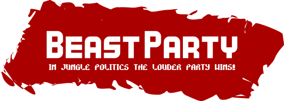
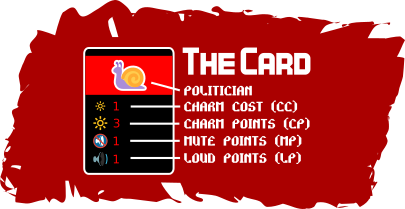
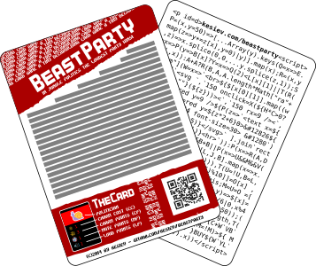

# Beast Party

    

---

    <a href="https://www.kesiev.com/beastparty/">Play the game</a>

---

**Beast Party** is a tiny deckbuilding card game code golfed in JavaScript that [you can play on a browser](https://www.kesiev.com/beastparty). The code uses just visible characters only and it's short enough to be printed anywhere - and that's how I used that. The project includes a printable SVG with the two card sides: one with the game rules and the other one with the game code. Print and sleeve them together for a nerdy gadget.

It's my little tribute to [deck-building card games](https://en.wikipedia.org/wiki/Deck-building_game), which are my personal board game favorites. If you want to suggest me some cool board game, feel free to [contact me on Twitter](https://twitter.com/KesieV).

## Game rules

Both players start with the **same 9 cards deck and 50 influence points**. Shuffle all decks. A turn starts **picking 5 cards from your deck** (if empty, replace it with your shuffled discard pile) and **filling the market to 5 cards** using the 50 cards market deck.

    

You can play any number of cards from your hand in front of you and:

  - **CHARM:** move one card from the market to your discard pile if the sum of played **CP** is equal or greater the card **CC** or
  - **MUTE:** move one card from the opponent party to his discard pile and pick a new card from your deck if the sum of played **MP** is equal or greater the opponent card **LP**.

 All your played cards are discarded after every action. **The turn ends** when you play your last card from your hand: the remaining played cards are your party. **Reduce your influence points by the sum of the opponent party LP and if hits 0, you lose!** Your opponent discards his party and starts his turn. Keep playing until there's a winner. **Good luck!**

## Code flavors

The <tt>code</tt> directory includes many versions of the game sources:

  * <tt>commented.html</tt> is a commented version of the sources you can use to learn how the game works and... well... improve it or fix bugs.
  * <tt>oneline.html</tt> a manually fixed [Packer](http://dean.edwards.name/packer/) oneliner version. HTML+JS is less than 1kb right now.
  * <tt>block.html</tt> is a working rectangle-shaped version of the code you can print on the back of a playing card. It's slightly different than the <tt>commented.html</tt> version, mostly because I've extended labels and added a few spaces to fit the card size. I've used this version for the SVG versions.

## Print flavors

    

The <tt>prints</tt> directory includes some printable SVGs:

  * <tt>sources.svg</tt> is a single card version with text boxes for rules, notes and code. While you can change it as you please, you may experience some problems with fonts and text sizes using [Inkscape](https://inkscape.org/). So...
  * <tt>print.svg</tt> is a full vector version with three cards. You can use this file for printing but the text is no longer editable.
  * <tt>size-full.pdf</tt> is a PDF version of <tt>print.svg</tt>
  * <tt>size-98.pdf</tt> is a PDF version of <tt>print.svg</tt>, printed scaled to 98% for easier sleeving

I've used the **KenVector Bold** font for the logo, the **Rocket Propelled** for the smaller text, the default **sans-serif** for the rules and **monospace** for the game code. If the printed cards don't fit the sleeves, try printing them smaller (ie. 98%).

## Objectives

For this project I set myself these rules:

  * The source code (HTML included) must be less than 1kb
  * The source code must be golfed and formatted to be printed on the face of a poker card staying readable
  * The rules and manual art must fit and be readable on the face of a poker card as well
  * The game must implement at least the basic mechanics of a deckbuilding game: _"A deck-building game is a card game where construction of a deck is the main focus of gameplay. It is similar to collectible card games (CCGs) in that each player has their own deck. However, unlike CCGs, the cards are not sold in randomized packs, and the majority of the deck is built during the game, instead of before the game. Typically, the cards provide a type of game currency that allows players to buy more cards to add to their decks."_ - [Wikipedia](https://en.wikipedia.org/wiki/Deck-building_game)
  * As for the majority of board games, the game material have to set a theme, using card art and inspired mechanics
  * The game must show recognizable cards, with rounded angles, card art and symbols explaining the card powers
  * Rules must be straightforward, possibly inspired by famous deckbuilding games (In this case I've got inspired by [Darwin Kastle](https://boardgamegeek.com/boardgamedesigner/4059/darwin-kastle)'s [Star Realms](https://www.starrealms.com/))
  * The game must be a 2-players game and the coded version must be played versus the computer
  * The computer AI must be challenging enough to force the player on understanding the rules and building some simple strategy to win

## Credits

  * [Sgananzium](http://www.sgananzium.it/), [TeOoh!](https://it-it.facebook.com/RecensioniMinute) and [Alkyla](https://www.youtube.com/channel/UCC7NoaDQUH4tTLxCeVZm0oQ) for spreading passion, information, culture and fun about board gaming here in Italy
  * [Darwin Kastle](https://boardgamegeek.com/boardgamedesigner/4059/darwin-kastle) for his super compact, flexible, clever and fun card games.
  * **Stefano Caroli**, **Massimo Emmanuele** and **Romolo Camplani** for sharing fun and thoughts on board games during lunch breaks
  * [Bianca](http://www.linearkey.net/) for sharing her life with me
  